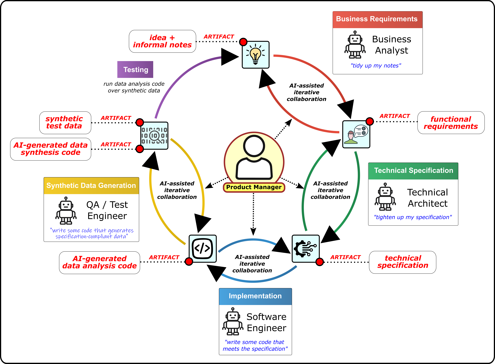

# The-AI-Team

I love it when a project plan comes together!

Imagine a large language model not as a tool, but as a teammate. A colleague, written in code. They’re sharp, articulate, and fast - when the road is clear. But widen the terrain, and they begin to stumble.

It’s a lot like forecasting the weather. Look up at the sky now, and you can tell if you’ll need an umbrella. Look ahead to tomorrow, and there’s room for doubt. A week from now? You’re rolling dice. A month away, and you’re basically reading tea leaves. LLMs aren’t so different. They don’t know the future. They predict. And the bigger the ask, the blurrier the forecast.

So how do we work with that? We don’t stare into the storm and hope. We break the horizon into something more manageable - a series of stepping stones. Each stone is a checkpoint. A chance to look down, test your footing, adjust your balance. A place to ask: are we still on the path? Do we need to nudge the model back in line? One careful step makes the next one possible. And slowly, what looked like fog begins to resolve into something we can actually navigate.

Now, in software we already have a process for this. We call it the Software Development Lifecycle. It’s how we take uncertainty and tame it — stage by stage, review by review.

So here’s the thought: What if we applied that same discipline to working with machines? What if, instead of firing off an instruction and crossing our fingers, we treated each stage of an AI-assisted creative process as a stepping stone - requirements, specification, development, testing - with the AI as just one more member of our team?

The phases remain the same. The uncertainty is still there. But step by step, checkpoint by checkpoint, the fog lifts. And what once felt chaotic becomes a path we can actually walk together.

